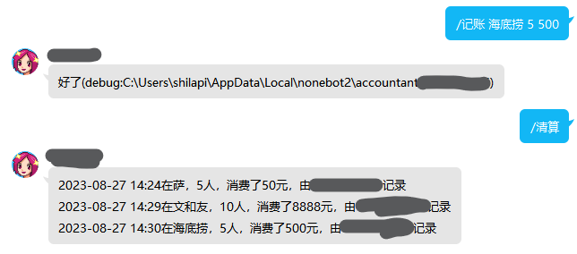

# nonebot-plugin-groupAccountant

## 📖 介绍

Nonebot 群记账插件

通过群消息记录开销，并保存在json文件中，可通过群消息读取

## 💿 安装

使用 nb-cli 安装

在 nonebot2 项目的根目录下打开命令行, 输入以下指令即可安装

    nb plugin install nonebot-plugin-groupAccountant

使用包管理器安装

在 nonebot2 项目的插件目录下, 打开命令行, 根据你使用的包管理器, 输入相应的安装命令

pip

    pip install nonebot-plugin-groupAccountant

pdm

    pdm add nonebot-plugin-groupAccountant

poetry

    poetry add nonebot-plugin-groupAccountant

conda

    conda install nonebot-plugin-groupAccountant

打开 nonebot2 项目根目录下的 `pyproject.toml` 文件, 在 `[tool.nonebot]` 部分追加写入

    plugins = ["nonebot_plugin_groupAccountant"]

## 🎉 使用
### 指令表
| 指令 | 权限 | 需要@ | 范围 | 说明 |
|:-----:|:----:|:----:|:----:|:----:|
| 记账 | 群员 | 否 | 私聊 | /记账 [开销名] [人数] [金额] |
| 清算 | 群员 | 是 | 群聊 | /清算 [clear] (可选，用于清空账本) |
### 效果图

